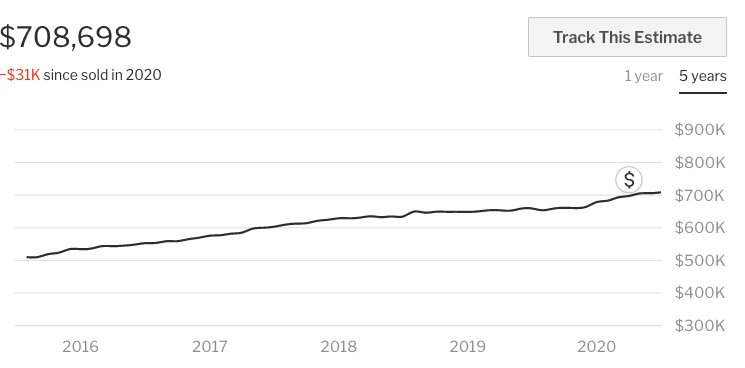

# MyPad

Web application that features home listings for buyers and sellers. Team project consisted of image carousel, mortgage calculator, graph estimation, and map module's. 

## Usage - Graph Module (Completed by Noel Mendoza)

Allows you to see in real time price estimations for current listing for the last year and up to 5 years.

## Example

## Development

- Was developed as an interactive front-end microservice utlizing JavaScript and React
- Architected an Express proxy server that handled routing API's
- Deployed housing microservice on EC2 utilizing AWS

## Related Modules for Web Application

  - https://github.com/HRSF125-MyPad/image_carousel_schedule_board_module
  - https://github.com/HRSF125-MyPad/calculator_menu_module
  - https://github.com/HRSF125-MyPad/image-carousel-from-static-map
